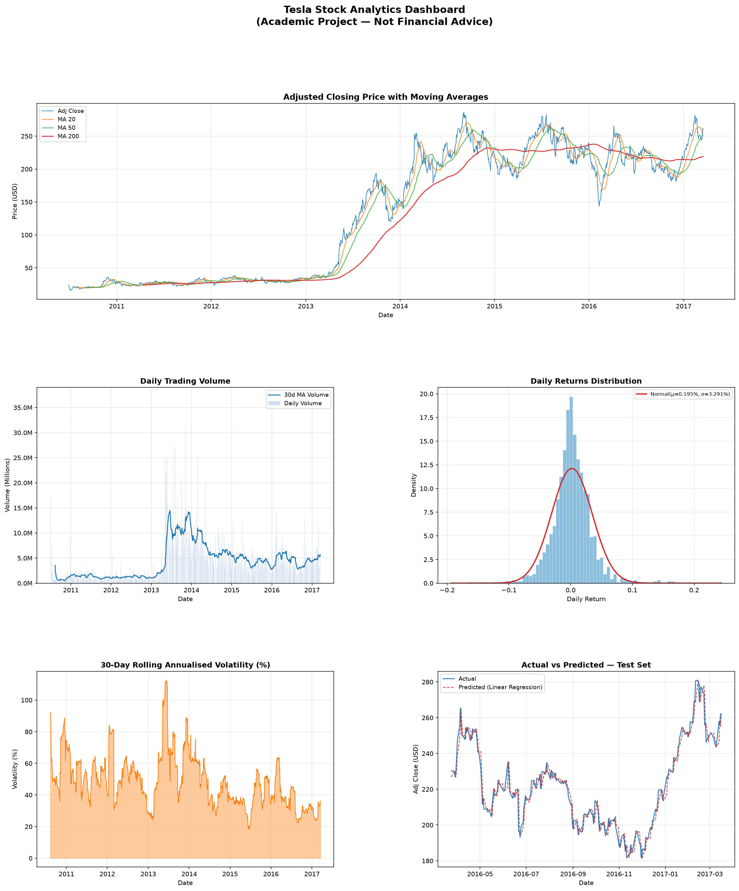
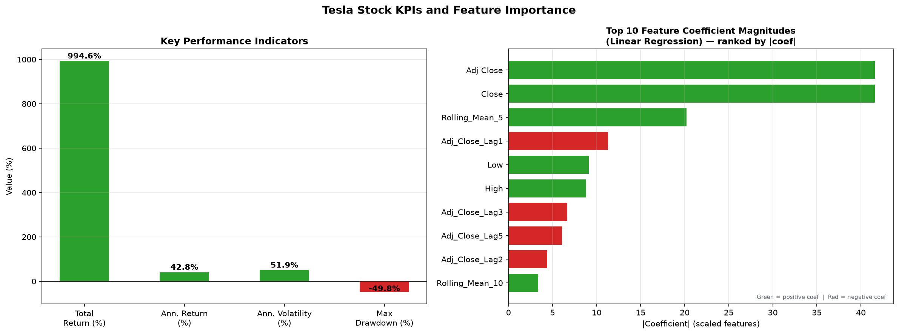

# Tesla Stock Analytics and Price Prediction Using Machine Learning

> **Academic Disclaimer:** This is an academic data analytics and machine learning project.
> Predictions are model estimates with quantified uncertainty and do **NOT** constitute
> financial advice or guaranteed future prices. Past stock performance does not guarantee future results.

---

## Project Description

A complete end-to-end academic data analytics and machine learning project that analyses historical
Tesla Inc. (TSLA) stock price data to extract meaningful insights, KPIs, trends, risks, and opportunities,
and to build a regression model that predicts the next trading day's adjusted closing price.

The project follows a rigorous analytical workflow — from raw data inspection through to machine
learning evaluation — and clearly distinguishes between observed **facts**, derived **insights**,
**risks**, **opportunities**, and **recommended actions**.

---

## Problem Statement

Financial data analysts face the challenge of extracting actionable insights from historical stock
data while avoiding common methodological pitfalls such as temporal data leakage, overfitting, and
overconfident forecasts. This project addresses:

1. How can historical Tesla stock data be systematically analysed to identify meaningful trends, KPIs, risks, and opportunities?
2. Can a machine learning regression model predict next-day closing prices with measurable accuracy using a methodologically rigorous time-series approach?

---

## Dataset Description

| Property       | Value                                  |
|----------------|----------------------------------------|
| File           | `Tesla.csv - Tesla.csv.csv`            |
| Records        | 1,692 daily trading rows               |
| Date Range     | 29 June 2010 – 17 March 2017           |
| Ticker         | Tesla Inc. (NASDAQ: TSLA)              |
| Missing Values | None                                   |

**Columns:** `Date`, `Open`, `High`, `Low`, `Close`, `Volume`, `Adj Close`

**Dataset Source:** [https://www.kaggle.com/datasets/rpaguirre/tesla-stock-price?resource=download]
*(Note: Column naming conventions match Yahoo Finance historical data export format. The exact source URL could not be confirmed from available project files and must be provided before final submission.)*

---

## Technologies Used

| Technology     | Version Constraint | Purpose                         |
|----------------|-------------------|---------------------------------|
| Python         | 3.8+              | Core language                   |
| pandas         | ≥1.5.0, <3.0.0   | Data loading and manipulation   |
| numpy          | ≥1.23.0, <2.0.0  | Numerical computation           |
| matplotlib     | ≥3.6.0, <4.0.0   | All visualisations              |
| scikit-learn   | ≥1.2.0, <2.0.0   | ML models, metrics, TimeSeriesSplit |
| python-docx    | ≥0.8.11, <2.0.0  | Programmatic Word report generation |

---

## Project Structure

```
e:\IBM\
├── Tesla.csv - Tesla.csv.csv            ← Original dataset (DO NOT MODIFY)
├── Tesla+stock+price+prediction.ipynb   ← Original notebook (DO NOT MODIFY)
│
├── tesla_stock_analytics.py             ← Main project Python file (run this)
├── requirements.txt                     ← Python dependencies
├── README.md                            ← This file
│
└── [Generated on first run]
    ├── Tesla_Stock_Analytics_Report.docx  ← Auto-generated Word report
    └── charts/
        ├── tesla_dashboard.png            ← 6-panel analytical dashboard
        └── tesla_kpi_summary.png          ← KPI and feature importance chart
```

---

## Data Visualization

- Created a 6-panel analytical dashboard  and KPI summary chart  to explore price trends, moving averages, trading volume, return distribution, rolling volatility, actual vs predicted prices, and feature influence.
- Conducted trend analysis, KPI analysis, and feature influence analysis.

---

## Installation Instructions

### Prerequisites
- Python 3.8 or later
- pip

### Install Dependencies

```bash
pip install -r requirements.txt
```

---

## How to Run the Project

```bash
python tesla_stock_analytics.py
```

The script will:

1. Load and inspect the Tesla dataset
2. Perform data quality assessment
3. Preprocess and engineer features
4. Run exploratory data analysis
5. Calculate all KPIs
6. Perform trend analysis
7. Train and compare three ML models using TimeSeriesSplit CV
8. Evaluate the best model on the held-out test set
9. Print structured analytical output with `[FACT]`, `[INSIGHT]`, `[RISK]`, `[OPPORTUNITY]`, `[ACTION]` labels
10. Save two chart files to `charts/`
11. Generate the Word project report `Tesla_Stock_Analytics_Report.docx`

**Estimated runtime:** 1–3 minutes depending on hardware (Gradient Boosting training is the slowest step).

---

## Analytical Workflow

The project follows this 12-step workflow:

1. **Data Loading and Understanding** — load CSV, inspect dimensions, date range, columns
2. **Data Quality Assessment** — missing values, duplicates, price anomalies
3. **Data Cleaning and Preprocessing** — derive returns, ranges, moving averages, drawdown
4. **Exploratory Data Analysis** — return statistics, distribution shape, up/down day counts
5. **KPI Identification** — 7 meaningful KPIs calculated and interpreted
6. **Trend Analysis** — MA-based trend signals, volume trend, 1-year trailing return
7. **Feature Engineering** — 26 features: lag features, rolling stats, MA ratios, OHLCV
8. **Machine Learning** — 3-model comparison on validation set + TimeSeriesSplit CV on train
9. **Model Evaluation** — MAE, RMSE, R², MAPE on held-out test set
10. **Risk and Opportunity Analysis** — volatility regimes, drawdown, prediction uncertainty
11. **Actionable Insights** — structured summary of findings and recommended actions
12. **Visualisation** — 2 multi-panel chart files + auto-generated Word report

---

## Key Analytical Findings

> These findings are based on the dataset (29 Jun 2010 – 17 Mar 2017).

**Facts (directly from data):**
- Tesla's Adj Close ranged from approximately $14 to $286 over the period
- Dataset contains no missing values and no price anomalies
- Daily returns show positive skewness and high kurtosis (fat-tailed distribution)

**Insights (derived):**
- Tesla delivered exceptional long-term returns over the period, driven by several major trend phases
- Trading volume increased substantially during parts of the second half of the dataset, indicating increased trading activity
- High annualised volatility of 51.92% is far above typical equity benchmarks (~15–20%), making risk management critical

**KPIs Summary (actual values from current implementation):**
| KPI | Value |
|-----|-------|
| Total Return | +994.60% |
| Annualised Return | +42.81% |
| Annualised Volatility | 51.92% |
| Return-to-Volatility Ratio | 0.8244 (NOT Sharpe — no risk-free rate applied) |
| Max Drawdown | −49.77% |

---

## Model Information

### Forecasting Horizon
**Next-day Adj Close (1-trading-day ahead forecast)**

*Rationale:* Short-horizon forecasting is the most reliable horizon for regression-based models on
financial data. Today's complete OHLCV data is fully known at market close before tomorrow opens.
This is the standard approach in academic stock forecasting literature.

### Data Split (chronological — no temporal leakage)
| Split       | Proportion | Purpose                         |
|-------------|------------|---------------------------------|
| Train       | 70%        | Model training                  |
| Validation  | 15%        | Model selection (no test contamination) |
| Test        | 15%        | Final evaluation (held out until end) |

### Models Compared
- **Linear Regression** (baseline)
- **Random Forest Regressor** (200 estimators)
- **Gradient Boosting Regressor** (200 estimators)

Model selection uses `TimeSeriesSplit` (5-fold) cross-validation on training data, confirmed by
validation RMSE. The test set is used **only once** for final reporting.

### Evaluation Metrics
- **MAE** — Mean Absolute Error (USD)
- **RMSE** — Root Mean Squared Error (USD) — error magnitude metric
- **R²** — Coefficient of Determination
- **MAPE** — Mean Absolute Percentage Error

---

## Limitations

1. **Single asset, single period** — findings are specific to Tesla 2010–2017 and may not generalise
2. **No exogenous data** — no news, sentiment, earnings, or macroeconomic features included
3. **Short horizon** — 1-day forecasting; multi-day forecasts carry substantially higher uncertainty
4. **Stationarity assumption** — feature-target relationships may break down in different market regimes
5. **No transaction costs** — slippage, taxes, and trading costs are not modelled
6. **Academic use only** — this project must not be used for actual trading or investment decisions

---

## Academic Disclaimer (Full)

This project is an academic data analytics and machine learning exercise produced as part of a
Data Analytics with AI internship programme. All analyses, KPIs, model predictions, and
recommendations in this project are for academic demonstration purposes only.

**Model predictions are point estimates. Formal prediction intervals are not calculated in this project. Predictions do NOT constitute financial advice, investment recommendations, or guaranteed future prices.**

Past stock performance does not guarantee future results. Tesla stock is subject to risks including
but not limited to: market volatility, regulatory changes, macroeconomic factors, and company-specific
events that this model cannot predict.
